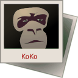

# Photos 
# Origin from Koko

The application of photos is based on Koko [github](https://github.com/JingOS-team/jing-photos/blob/master/TODO) , a beautifully designed photos that conforms to the JingOS style and has a compatible `pad / desktop` experience.

## Contributing

Koko Project https://invent.kde.org/graphics/koko/.

The [KDE Community Code of Conduct](https://kde.org/code-of-conduct) is applied.

## Features

* Brand new UI & UE with JingOS-style , based on JingUI Framework
* Run on JingOS platform
* Support keyboard & touchpad & mouse & screen touch 
* Support image rotation, clipping and deletion
* Pictures and videos are arranged in positive time order
* The database caches pictures and video information

## License

This project is licensed under the LGPL-2.1-only OR LGPL-3.0-only OR
LicenseRef-KDE-Accepted-LGPL. More information can be found in the
`LICENSES` folder.

## Packaging

To build Jing-Photos, it is required to have a few files packaged with the
application. These files are licensed under the CC-BY-SA-4.0.

* http://download.geonames.org/export/dump/cities1000.zip
* http://download.geonames.org/export/dump/admin1CodesASCII.txt
* http://download.geonames.org/export/dump/admin2Codes.txt

These files need to be copied to the `src` directory. CMake will
take care of the rest.

## Links

- Home: [www.jingos.com](http://www.jingos.com/)
- Project page: github.com/jingOS-team/koko
- File issues: github.com/jingOS-team/koko/issues
- Development channel: [www.jingos.com](http://www.jingos.com/)

## Installing

```
mkdir build
cd build
cmake ..
make
sudo make install
```


